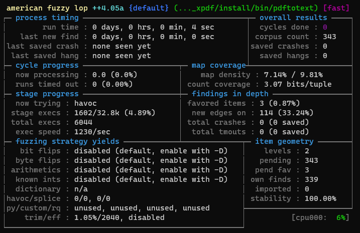

# CS182-AFL++--Demo 

Group Members: 
- Jerry Xu
- Ivan Monroy
- Nathan Nguyen

# Requirements
- Debain based linux distribution (i.e. Ubuntu/Debian/etc) to use the apt package manager
- or Virtual Machine/Windows Subsystem for Linux (WSL)

# Downloading and Setting up Xpdf 
First we will set up the target program: Xpdf version 3.02 (This version still has the bug we are trying to recreate)

```
cd $Home
mkdir fuzzing_xpdf && cd fuzzing_xpdf/
```

In order to build and extract the program we need make and gcc which we install with: 

```
sudo apt install build-essential
```

Download Xpdf Version 3.02:
```
wget https://dl.xpdfreader.com/old/xpdf-3.02.tar.gz
tar -xvzf xpdf-3.02.tar.gz
```

Build Xpdf after extracting it:
```
cd xpdf-3.02
sudo apt update && sudo apt install -y build-essential gcc
./configure --prefix="$HOME/fuzzing_xpdf/install/"
make
make install
```


# Installing AFL++

We can either locally install AFL++ or use the Docker image for this class we used the local install

Required Dependencies:
```
sudo apt-get update
sudo apt-get install -y build-essential python3-dev automake git flex bison libglib2.0-dev libpixman-1-dev python3-setuptools
sudo apt-get install -y lld-11 llvm-11 llvm-11-dev clang-11 || sudo apt-get install -y lld llvm llvm-dev clang 
sudo apt-get install -y gcc-$(gcc --version|head -n1|sed 's/.* //'|sed 's/\..*//')-plugin-dev libstdc++-$(gcc --version|head -n1|sed 's/.* //'|sed 's/\..*//')-dev
```

Then we build AFL++

```
cd $HOME
git clone https://github.com/AFLplusplus/AFLplusplus && cd AFLplusplus
export LLVM_CONFIG="llvm-config-11"
make distrib
sudo make install
```

# How To Run

To check that installation worked corrrectly we can just run ``` afl-fuzz ``` in our terminal

First we need to build Xpdf using the afl-clang-fast compiler:
```
export LLVM_CONFIG="llvm-config-11"
CC=$HOME/AFLplusplus/afl-clang-fast CXX=$HOME/AFLplusplus/afl-clang-fast++ ./configure --prefix="$HOME/fuzzing_xpdf/install/"
make
make install
```

Then we can use our newly installed AFL++ fuzzer on the program with this commmand:
```
afl-fuzz -i $HOME/fuzzing_xpdf/pdf_examples/ -o $HOME/fuzzing_xpdf/out/ -s 123 -- $HOME/fuzzing_xpdf/install/bin/pdftotext @@ $HOME/fuzzing_xpdf/output
```

After a few minutes your terminal should display the fuzzer running like this: 


Once a crash is found, it will outputted into the ```$HOME/fuzzing_xpdf_out/``` directory. Depending on the machine that is running the fuzzer it can take time ranging from an hour or more to get a crash.
